# Penumbra EXP 阶段与条件静态分析

日期：2026-10-06。任务：EXP-AUDIT-01。分析目录：`D:/Code/Rust/penumbra-main`。

本轮分析当前本地源文件的调用位置、标准命令边界和适用条件。参考目录没有 Git 元数据，不能用历史 `ce13391` 标识本快照。没有运行 Rust EXP、生成攻击材料、连接设备或验证漏洞；下文“检查通过”只指代码中的条件，不能解释为硬件确认。

## 1. 清单与主入口

`core/src/exploit` 有三个独立漏洞策略：Linecode、Carbonara、HeapBait；另有采用同一 `Exploit` 接口的 Unfused 补丁入口。Unfused 依据设备返回的安全标志工作，本身没有漏洞触发过程。

扫描全部 Rust/Python 源文件和 Cargo 配置后，未发现额外的独立 Kamakiri、Amonet 或 Hashimoto 策略。`KamakiriError`、`scripts/pack_kamakiri.py`、`scripts/data/kamakiri.csv` 的名字仍保留，但当前运行时入口是 Linecode。`docs/content/Mediatek/Exploits/Kamakiri.md` 描述的旧 SendCert/TX-buffer 路线，不能当作当前 Linecode 的另一份实现。

主调用链是 `Device::init → Device::enter_da_mode → init_da_protocol → DownloadProtocol::upload_da`：

- `Device::init` 在握手后查询安全配置、芯片身份、SOCID/MEID；BROM 中提供 auth 文件时，先进行 `SEND_AUTH`，SLA 开启时再尝试 BROM SLA。
- 因此当前 Rust 自动 Linecode 的位置在上述初始化之后。它不是 `Device::init` 中标准 auth 之前的隐式操作。
- `enter_da_mode` 根据选中的 DA 条目创建 XFlash V5 或 XML V6；V3 在此快照中拒绝。
- 当前连接已经是 DA 时，`enter_da_mode` 不调用 `upload_da`，这些上传阶段策略不会自动重新执行。

证据：[设备初始化](D:/Code/Rust/penumbra-main/core/src/device.rs:219)、[进入 DA 与版本选择](D:/Code/Rust/penumbra-main/core/src/device.rs:376)、[策略目录](D:/Code/Rust/penumbra-main/core/src/exploit/mod.rs:5)。

## 2. 阶段与前后命令总表

表中的前后命令是宿主标准流程的边界；EXP 内部交互不应误认为下一阶段已经完成。

| 路径 | 执行阶段 | 前置边界 | 后续标准命令/边界 | 主要条件 |
| --- | --- | --- | --- | --- |
| XFlash Unfused | BROM/Preloader，DA1 上传前 | `Device::init` 已完成；进入 `upload_da` | Linecode 候选检查之后，`SEND_DA (D7)` 上传 DA1 | `patched=false`，DAA/SBC/SLA 三标志均关闭 |
| XML Unfused | BROM/Preloader，DA1 上传前 | `Device::init` 已完成；进入 `upload_da` | `SEND_DA (D7)`，随后 `JUMP_DA (D5)` | 同上；没有自动 Linecode 调用 |
| XFlash Linecode | BROM，DA1 上传前 | Unfused 已尝试且未设置 `patched=true` | `run` 内复查 `GET_TARGET_CONFIG (D8)`，完成本地 DA 补丁后，标准 `SEND_DA (D7)` | BROM、内嵌表匹配 HW code、USB control transfer 可用 |
| 独立 Linecode | BROM，加载自定义 Preloader/二进制前 | `PlProtocol::exploit` 查询 `GET_TARGET_CONFIG (D8)` | 调用方 `bootpl` 的 `SEND_DA (D7)`、`JUMP_DA (D5)` | cfg 非零才触发；cfg 为零直接返回；此入口不修改 DA 和协议 `patched` |
| XFlash Carbonara | DA1 已运行，DA2 上传前 | DA1 `C0`、SyncSignal、环境/硬件初始化、EMI、SetChecksumLevel；之后第一次 `GetPacketLength (0x040007)` 完成 | 真正上传并启动 DA2 的 `BootTo (0x010008)` | `patched=false`；DA1 未命中保护特征；摘要位置可定位；DA2 补丁流程返回成功 |
| XML Carbonara | DA1 已运行，DA2 上传前 | Runtime、HostSupportedCommands、SetHostInfo、第一次 NotifyInitHw 的 progress/END；随后 DA1 SLA 流程返回 | 真正 DA2 的 `CMD:BOOT-TO`、数据传输和 END | 同上；还必须能走过前面的 DA1 SLA 流程 |
| XML HeapBait | DA2 已运行，DA2 SLA 查询前 | 真正 DA2 BOOT-TO 完成；第二次 HostSupportedCommands、NotifyInitHw 的 progress/END 完成 | `handle_sla` 的 `CMD:GET-SYS-PROPERTY`，key 为 `DA.SLA` | `patched=false`；XML；DA2 未命中保护特征；已识别 SoC；分析器能定位所需函数/结构 |
| XFlash 扩展加载 | DA2 SLA 流程之后 | `handle_sla` 返回，第二次 `GetPacketLength` 完成 | 扩展 BootTo、ExtAck、context 设置 | `patched=true`、已知 SoC、扩展依赖可解析；不是独立漏洞策略 |
| XML 扩展加载 | DA2 SLA 流程之后 | HeapBait 候选检查和 `handle_sla` 已返回 | 扩展 BOOT-TO、ExtAck、ExtDaCtx | 同上 |

XFlash 定位：[upload_da](D:/Code/Rust/penumbra-main/core/src/da/xflash/protocol.rs:377)、[DA1 初始化](D:/Code/Rust/penumbra-main/core/src/da/xflash/protocol.rs:210)。XML 定位：[upload_da](D:/Code/Rust/penumbra-main/core/src/da/xml/protocol.rs:607)、[DA1 初始化及 SLA](D:/Code/Rust/penumbra-main/core/src/da/xml/protocol.rs:279)。独立入口：[PlProtocol::exploit](D:/Code/Rust/penumbra-main/core/src/preloader/protocol.rs:408)、[bootpl 调用](D:/Code/Rust/penumbra-main/tui/src/cli/commands/device/bootpl.rs:94)。

## 3. 默认时序

下面的策略节点表示到达调用位置，实际运行仍受 `patched` 控制。

```mermaid
flowchart TD
  subgraph X["XFlash V5"]
    X0["Device.init：握手、身份与安全配置、可选 BROM auth"] --> X1["Unfused → Linecode 候选检查"]
    X1 --> X2["D7 / D5：DA1 上传与跳转"]
    X2 --> X3["C0 / SYNC / 环境与硬件初始化 / EMI / 校验配置"]
    X3 --> X4["第一次 GetPacketLength"]
    X4 --> X5["Carbonara 候选检查：Da1Ready"]
    X5 --> X6["真正 DA2 BootTo 完成：Da2Ready"]
    X6 --> X7["DA2 SLA 流程 / 第二次 GetPacketLength"]
    X7 --> X8["扩展加载：Da2Authenticated 对应边界"]
  end
  subgraph V["XML V6"]
    V0["Device.init：握手、身份与安全配置、可选 BROM auth"] --> V1["Unfused 候选检查"]
    V1 --> V2["D7 / D5：DA1 上传与跳转"]
    V2 --> V3["Runtime / 首次 HostSupported / HostInfo / Notify 的 progress 与 END"]
    V3 --> V4["DA1 SLA 流程返回"]
    V4 --> V5["Carbonara 候选检查：Da1Ready"]
    V5 --> V6["真正 DA2 BOOT-TO / 数据 / END"]
    V6 --> V7["第二次 HostSupported / Notify 的 progress 与 END"]
    V7 --> V8["HeapBait 候选检查：Da2Ready"]
    V8 --> V9["DA2 SLA 流程返回"]
    V9 --> V10["扩展加载：Da2Authenticated 对应边界"]
  end
```

XFlash 的 `reenumerate` feature 若启用，会在 DA1 SetChecksumLevel 之后、第一次 GetPacketLength 之前执行 SwitchUsbSpeed/重枚举。`upload_stage1` 完成意味着这段条件路径也已完成。

XML 的 `xmlcmd_p!` 同时处理 progress 和 `CMD:END`，因此不能只收到第二次 NotifyInitHw 的初始 ACK 就认为 HeapBait 的调用边界已经到达。[宏定义](D:/Code/Rust/penumbra-main/core/src/da/xml/macros.rs:27)。

## 4. 各策略条件与证据强度

### 4.1 Unfused

[实现](D:/Code/Rust/penumbra-main/core/src/exploit/mod.rs:161) 要求 DAA、SBC、SLA 均关闭。对应 target config 的低三位；代码并不要求整个 config 等于零，也没有读取熔丝确认“未熔断”。Unfused 这个名字不能替代实际安全配置证据。

检查通过后调用 `patch_da`，顺序为先本地 patch DA2，再 patch DA1。此时 DA1 尚未上传，两个阶段都可在宿主侧修改。其返回成功不代表所有可选补丁都已命中：补丁函数中的部分未匹配情况会返回 `Ok(false)`，上层没有逐项保存状态。

### 4.2 Linecode

[trigger](D:/Code/Rust/penumbra-main/core/src/exploit/linecode.rs:125) 的显式门槛是：当前 `ConnectionType::Brom`、GET_HW_CODE 对应条目存在、USB 控制读取成功。接着利用 BROM USB control/区域访问的交互路径；是否真的未修复、条目中的布局是否与设备版本一致，仍需硬件证据。

当前 `brom_defuse.bin` 元数据中有 34 个 HW code，已与 CSV 核对：

`6572, 6580, 6582, 6592, 6595, 0321, 0335, 0699, 0337, 0326, 0551, 0717, 0690, 0766, 0707, 0788, 0725, 0813, 6795, 0279, 0816, 8127, 8163, 8167, 8172, 8695, 0886, 0562, 0950, 0959, 0989, 0996, 8512, 8590`（均为十六进制）。

这只是内嵌布局表的覆盖范围，不是 34 个芯片均已真机成功的证明。代码按 HW code 匹配，没有进一步核对 BROM 修订版本。

LibUsb 和 nusb 后端实现控制传输；Serial 后端的 `ctrl_in/ctrl_out` 固定返回失败，所以当前 Linecode 不能经纯串口后端运行。[Serial 实现](D:/Code/Rust/penumbra-main/core/src/port/backend/serial_backend.rs:236)。

[run](D:/Code/Rust/penumbra-main/core/src/exploit/linecode.rs:188) 在触发后复查 D8、更新 DevInfo、patch DA1/DA2。它没有显式要求复查后的三个安全标志全部关闭，且 D8 使用 `unwrap`；不能仅根据 `Ok(true)` 宣称设备认证已解除。

两个入口的差异：自动 XFlash 入口受 `patched` 控制；独立 `PlProtocol::exploit` 以整个 cfg 是否为零决定是否调用 trigger，不使用协议 `patched`，也不执行 `patch_da`。XML `upload_da` 没有调用 Linecode，即使 Linecode 的 trait 实现是泛型，也不能推断 XML 会自动尝试它。

### 4.3 Carbonara

[实现](D:/Code/Rust/penumbra-main/core/src/exploit/carbonara.rs:45) 针对已运行 DA1 的 BOOT-TO 目标处理与 DA2 完整性校验边界。当前代码先 patch 宿主侧 DA2，并尝试改变 DA1 运行时的参考摘要；随后才由正常 `upload_da` 上传真正 DA2。它不把已运行 DA1 替换为另一份 DA1。

需要区分以下条件：

1. 必须已经成功上传、跳转和初始化 DA1。DAA 要求仍然存在时，必须具备设备能接受的 DA1；Carbonara 的位置不能解决更早的 DA1 拒绝。
2. XML 还必须先走过 DA1 SLA。若 DA1 SLA 阶段失败，控制流到不了 Carbonara；明确 Unsupported 或不要求 SLA 是另外的正常分支。
3. `is_vulnerable` 在 DA1 搜索四组保护特征，任一命中便拒绝，全部未命中只得到“可能适用”。它没有按手机型号或发布日期判定。
4. DA1 中必须能定位 DA2 摘要槽；V5 与 V6 使用不同的元数据/布局定位规则。
5. 实际需要正确的摘要类型与合适的 DA2 补丁结果。代码对 Unknown 摘要类型返回空摘要，没有严格拒绝；静态条件通过不能据此推断运行成功。
6. Carbonara 内部 BOOT-TO 的错误通过 `.ok()` 丢弃，随后仍返回 `Ok(true)`。正常 DA2 的 BOOT-TO 是后面的独立调用，其失败仍会导致上传失败。

摘要定位：[DaEntryExt](D:/Code/Rust/penumbra-main/core/src/exploit/mod.rs:30)。Unknown 行为：[hash](D:/Code/Rust/penumbra-main/core/src/utils/hash.rs:18)。

### 4.4 HeapBait

[实现](D:/Code/Rust/penumbra-main/core/src/exploit/heapbait.rs:216) 只为 XML 提供，作用于已经运行的 DA2。它依赖 DA2 主机文件接收的长度处理、堆分配/释放和 DPC 机制。相关命令入口是 `CMD:SECURITY-SET-ALLINONE-SIGNATURE`；当前报告不展开构造载荷和内存破坏参数。

显式条件包括：

1. `patched=false`，所以默认调度中通常位于 Unfused/Carbonara 没有报告成功的后续路径。
2. DA2 未命中四组保护特征，包含代码指令特征和 `protocol buffer overflow` 文本；未命中仍只是候选判断。
3. `DevInfo.chip()` 必须存在，才能取得对应芯片资料。
4. ARM32/AArch64 分析器必须成功定位堆、命令注册、命令循环和 DPC 等依赖；本地 DA 内容必须匹配实际运行的 DA2。
5. DA1、DA1 SLA、真正 DA2 上传以及第二次 Notify 的 progress/END 都已经完成；它不需要先完成 DA2 SLA，因为调用位置就在 DA2 SLA 之前。
6. 设备端相关命令必须在这个阶段可调用，文件接收缺陷和堆行为仍然存在，资源足以完成交互。这些是运行前提，代码没有完整预检。

HeapBait 在执行后才计算本地 DA2 补丁差异，并通过其载荷提供的内存修改命令应用到正在运行的 DA2；这与 Unfused/Linecode 在 DA1 上传前修改容器、Carbonara 在 DA2 上传前修改数据不同。

宿主代码会先构造约 80 MiB 的前导数据，再追加内嵌载荷；还会复制 DA2 做差异计算。这是可从分配表达式得出的内存行为，没有进行本轮内存运行测量，也不能用它推定所有设备的可用 DRAM 条件。[构造函数](D:/Code/Rust/penumbra-main/core/src/exploit/heapbait.rs:107)、[运行中补丁](D:/Code/Rust/penumbra-main/core/src/exploit/heapbait.rs:191)。

代码没有显式要求“Carbonara 已修复”才尝试 HeapBait；任何没有设置 `patched=true` 且仍能继续到达 DA2 的前置结果，都可能使其被调用。

## 5. EXP 目录之外的相关路径

| 路径 | 执行时机 | 条件与作用边界 |
| --- | --- | --- |
| XFlash dummy SLA 回退 | DA2 BootTo 后，第二次 GetPacketLength 前的 `handle_sla` | SLA 状态报告开启、没有可用 signer、编译启用 exploits 时尝试 SetRemoteSecPolicy；没有 `patched=true` 门槛，最终由设备接受或拒绝 |
| XML dummy SLA 回退 | DA1 初始化末尾及 DA2 HeapBait 候选检查后的两次 `handle_sla` | `DA.SLA` 报告开启、没有 signer、exploits 开启时尝试 SecuritySetFlashPolicy；同样不要求 patched，也不是独立漏洞策略 |
| XFlash DA patch | Unfused/Linecode：DA1 上传前；Carbonara：DA2 上传前 | 包含 BOOT-TO 扩展入口、DA SLA、安全策略与可选 anti-rollback 等处理；依赖二进制特征匹配，不获得前置 DA1 加载权限 |
| XML DA patch | Unfused：DA1 上传前；Carbonara：DA2 上传前；HeapBait：DA2 运行中 | 包含 BOOT-TO 扩展入口、SLA 处理和安全策略/SBC 等处理；运行中应用依赖 HeapBait 提供的能力 |
| 扩展加载 | 两种协议 DA2 SLA 流程之后 | 要求 patched、已知 SoC、可解析扩展依赖、可用加载入口和设备 ACK/context 交互；不是认证前策略 |
| CLI `patchda` | 离线宿主文件处理 | 直接使用对应 DA patch 函数；没有设备交互，不能据输出文件存在证明设备会接受它 |
| CLI `crash` | 进入 DA 之前的独立命令 | 尝试通过异常 DA 上传使设备回到 BROM，然后重枚举/握手；不是 upload_da 中的自动重连，更不能把“已回 BROM”当成权限获得 |

证据：[XFlash SLA](D:/Code/Rust/penumbra-main/core/src/da/xflash/protocol.rs:826)、[XML SLA](D:/Code/Rust/penumbra-main/core/src/da/xml/protocol.rs:898)、[XFlash patch](D:/Code/Rust/penumbra-main/core/src/da/xflash/patch.rs:20)、[XML patch](D:/Code/Rust/penumbra-main/core/src/da/xml/patch.rs:19)、[XFlash extensions](D:/Code/Rust/penumbra-main/core/src/da/xflash/exts.rs:29)、[XML extensions](D:/Code/Rust/penumbra-main/core/src/da/xml/exts.rs:147)、[patchda](D:/Code/Rust/penumbra-main/tui/src/cli/commands/cli/patchda.rs:40)、[crash](D:/Code/Rust/penumbra-main/tui/src/cli/commands/device/crash.rs:30)。

内嵌二进制的归属：`brom_defuse.bin` 属于 Linecode；`hakujoudai.bin` 属于 HeapBait；`sla_xml.bin` 属于 XML SLA 补丁；`extloader_v5.bin`/`extloader_v6.bin` 属于 DA 的扩展加载入口补丁；`da_x.bin`/`da_xml.bin` 是后续 DA 扩展。七个文件不能解释成七个独立漏洞。

## 6. 调度、失败与成功状态

[exploit! 宏](D:/Code/Rust/penumbra-main/core/src/macros.rs:2) 仅在编译启用 `exploits` 且 `patched=false` 时调用策略。核心默认 feature 包含 exploits；TUI 显式启用它。[Cargo 配置](D:/Code/Rust/penumbra-main/core/Cargo.toml:41)。

宏对 `Err` 不上抛、不记录，只在 `Ok(result)` 时将 `patched` 设为 result。由此可以得出：

- Unfused 成功后，XFlash 的 Linecode/Carbonara、XML 的 Carbonara/HeapBait 都跳过。
- XFlash Linecode 成功后跳过 Carbonara。
- XML Carbonara 报告成功后跳过 HeapBait。
- `.ok()` 或 `Ok(false)` 会丢失部分真实结果；Carbonara 尤其可能在内部 BOOT-TO 失败后仍设置 patched，进而阻止 HeapBait 候选检查。
- 失败的策略可能已改动 DA 或设备，宏没有回滚/失效会话机制。继续执行不等于失败前的状态仍完整。
- `patched` 不表示 BROM SLA、DA1 SLA、DA2 SLA 或扩展 ACK 已确认成功。
- XFlash SLA 状态查询失败会直接 `Ok(())`；XML 只对明确 Unsupported 容忍。因此“handle_sla 返回”与“已认证”必须区分。
- 扩展加载外层 `.ok()` 丢弃错误；XFlash 外层 helper 在内部返回 `Ok(false)` 时仍返回 `Ok(true)`，也不能把连接成功当成扩展能力已就绪。

## 7. 与现有宿主阶段契约的对应

| GeekFlashCore 阶段 | 当前 Penumbra 的参考位置 | 解释 |
| --- | --- | --- |
| BeforeDa1 | XFlash Unfused/Linecode，XML Unfused | DA1 尚未上传；Rust 的自动入口已在 Device.init 的可选 BROM auth 之后，不能把完整前置顺序视为与 C# 相同 |
| Da1Ready | XFlash 第一次包长查询之后；XML DA1 SLA 流程之后的 Carbonara 位置 | DA1 已运行；可处理尚未上传的 DA2 数据 |
| Da2Ready | XML 第二次 HOST/NOTIFY/progress/END 后的 HeapBait 位置 | XFlash 对应 DA2 BootTo 后的观察点，此快照没有该处的独立 EXP |
| Da2Authenticated | DA2 SLA 流程返回后；XFlash 还需第二次包长查询 | 对应后续扩展加载入口；认证证据仍须单独表达 |

这只是接口阶段语义的对照。本轮未修改 GeekFlashCore 公共契约、协议实现或策略框架，也未添加任何具体策略。

## 8. 指纹、验证与恢复

用于固定关键分析证据的 SHA256：

| 本地参考文件 | SHA256 |
| --- | --- |
| core/src/exploit/mod.rs | 93D446586F5B16538FBD8B54200796536419F1F64486AE28C0A3372AE65A7F00 |
| core/src/exploit/linecode.rs | D7D1C8E03A2C4B571BCAE0F90F957AE5F93AB924E249A07D2F8EED796052F575 |
| core/src/exploit/carbonara.rs | AD43347F54887F83E00EDEAF607620EBAEA5AEE9377D5AC28098D3E8794D0B00 |
| core/src/exploit/heapbait.rs | 1CDD6D76688241BFD49F2A3A88506ECCE2A4B9446A14DDD422FB017CE1701C7B |
| core/src/da/xflash/protocol.rs | CB17E5926F4D0483DC7DABA44792AAD23BD73DA6C02A316783EE518E3AC84E23 |
| core/src/da/xml/protocol.rs | B9ED36BD0F956A26DB249EA19587A66457C77F3B98D50CE28FC0D1F1CE9F5408 |
| core/src/macros.rs | 1100C6949EC249F60DE6EEF3CF4FAFE59969928BED5005DC40A721AF0A718522 |
| core/payloads/brom_defuse.bin | E9C0C3F72347B2FE15B20B27633768BB130F36E3F4011FC55FB69A0164172854 |

2026-10-06 / EXP-AUDIT-01 验证：

- 全部策略实现、`exploit!` 调用点、独立 PL 调用、DA patch/exts/SLA/CLI 路径完成静态交叉检查；Linecode 内嵌表与 CSV 的 34 个 HW code 一致。
- 当前主工作区初始 tracked/untracked 状态干净，HEAD 为 `9159d62`；参考目录没有 Git 元数据。
- `dotnet build GeekFlashCore.slnx -c Release --no-restore --verbosity quiet`：成功，0 警告、0 错误。
- 主工作区没有 `.tests/GeekFlashCore.Protocol.Mtk.Tests` 目标测试工程，因此在保留夹具的 `C:/Users/a1375/.codex/worktrees/8d7a/GeekFlashCore` 执行现有 `ExploitFrameworkTests|XmlCheckpointAuthenticationTests`，Release/no-build/no-restore：56 通过，0 失败/跳过。
- `git diff --exit-code main codex/mtk-protocol -- src GeekFlashCore.slnx`：无生产代码差异。这些 C# 测试仅证明既有阶段框架的回归结果，不能验证 Rust EXP。
- `git diff --check`：通过；新增文档的 no-index 检查没有空白错误，只出现 LF/CRLF 转换提示；30 个源码链接均指向存在的文件。
- 分析结束复查上述 8 个 SHA256，与读取时一致；工作区只有本分析文档和实施记录两处预期文档变更，没有提交。

剩余风险：没有真机、抓包、DA 固件逐版本测试或 EXP 成功证据；保护特征缺失、布局表匹配和 patched 标志都不是漏洞确认。内嵌载荷只有二进制引用，本轮未逆向其内部行为。后续分析应先确认参考文件指纹，再结合实际 DA1/DA2 版本和合法正常协议抓包核对阶段；不能从手机发布日期、营销型号或旧 Kamakiri 文档推定可用性。
